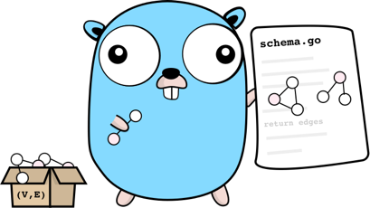

# Distributed URL shortener



- Written in Go using go-swagger as server generator
- Made with Clean Architecture in mind (handlers -> services -> repositories)
- Includes service & handler go tests based on auto-generated mocks with go:generate and mockery
- Uses 62 symbols for encoding/decoding keys
- Can store up to 3.5 trillion keys. It's enough for more 100 years on 1000 rps :fire:
- Contains 3 API nodes, but you can easily add new nodes
- Coordinates API nodes via etcd
- Stores data in mongodb (For simplicity the app uses one instance but in production mode you should definitely use mongodb cluster)
- Contains nginx server to proxy requests to API nodes

### Start

```
docker-compose up --build
```

If you need to clean up all stored data please run

```
docker-compose down --v
```

Also, after start the application you can:
- use postman collection (from `examples/postman`) to send requests
- use ab command to test concurrency behaviour

```
ab -p ./examples/ab/url.json -T application/json -c 10 -n 100 http://localhost:8080/links
```

- read docs and play with swagger on `localhost:8080/docs` 